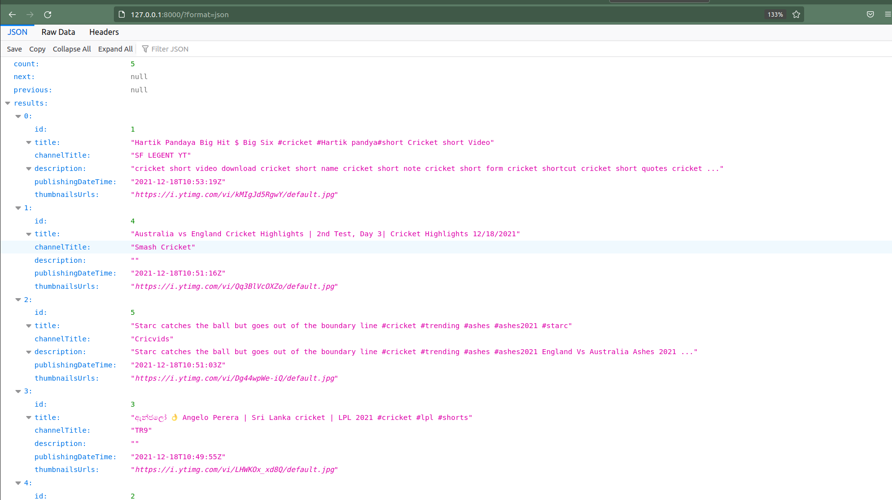
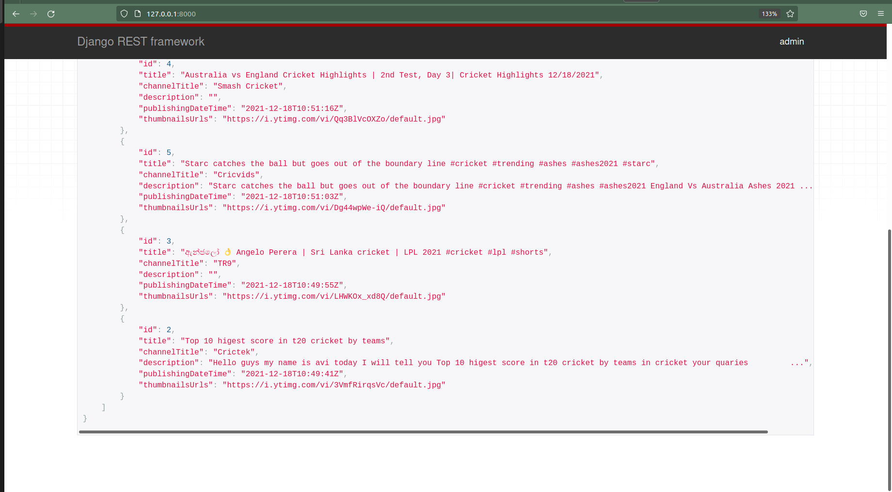
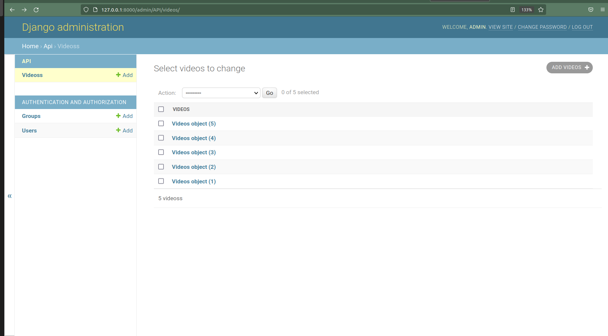
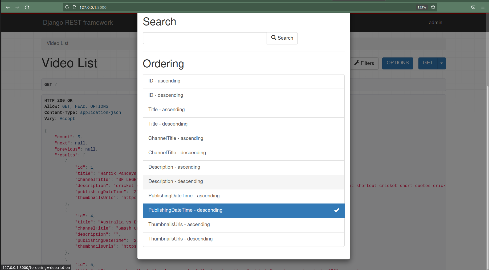
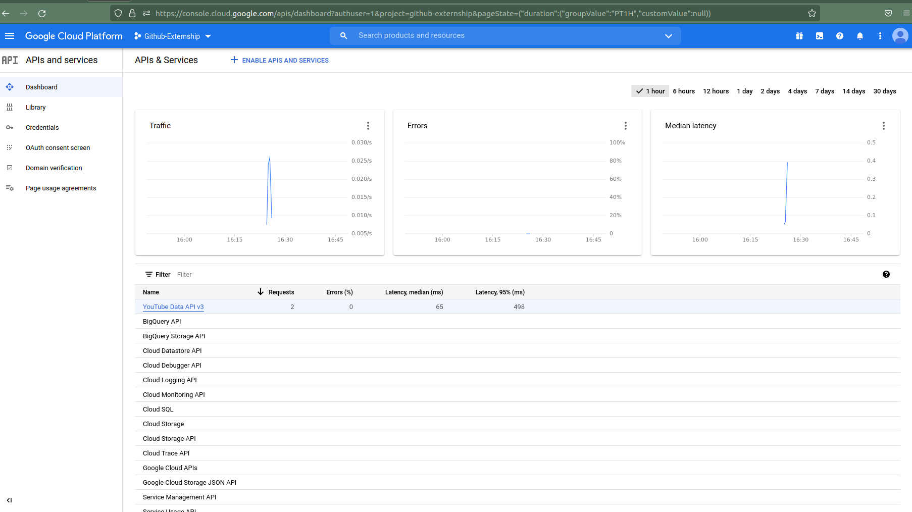
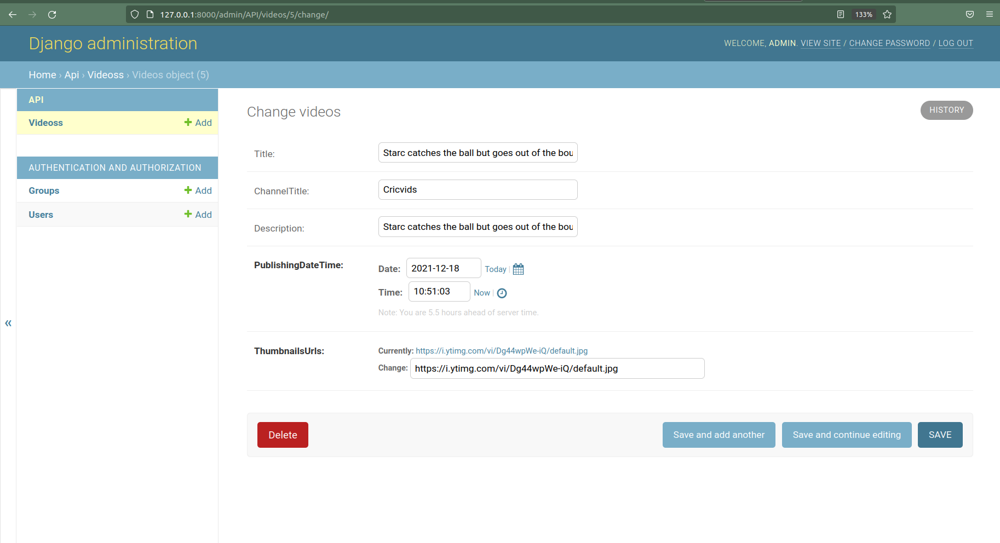

 <div align="center"> 
 
 </div>

<h1 align="center">

Fampay - Backend Assignment Extern
</h1>


### Project Goal ✨

To make an API to fetch latest videos sorted in reverse chronological order of their publishing date-time from YouTube for a given tag/search query in a paginated response.

**Screenshots:**

|   |   |
|:---:|:---:|
| Json format | HomePage |

|   |   |
|:---:|:---:|
| Database view | Filtering/Sorting |

|   |   |
|:---:|:---:|
| YoutubeApi_keys | Single Video View |

## Instructions for Setup

Clone the repo and install Requirements :

```bash
git clone https://github.com/yashikajotwani12/API_Youtube
cd API_Youtube
pip3 install -r requirements.txt (Install the requirements preferrably in Virtual environment)
```

Modify settings.py File - Remove the existing keys and add your own YouTube Data API keys in the form [key1, key2, ...]:

```bash
API_KEYS = ['Google_API_Key_1', 'Google_API_Key_2','Google_API_Key_3',] 
```

## Usage

Run the manage.py file:

```python
python3 manage.py runserver
```
## Reference:

    YouTube data v3 API: https://developers.google.com/youtube/v3/getting-started
    Search API reference: https://developers.google.com/youtube/v3/docs/search/list
    To fetch the latest videos you need to specify these: type=video, order=date, publishedAfter=<SOME_DATE_TIME>
    Without publishedAfter, it will give you cached results which will be too old


## Directory Structure
    
    API_Youtube            
    .
    ├── Contains       
    |   ├── Screenshots       # Contain screenshots of the project and other images
    │   ├── API               # The main Django app/api containing the models, views, serializers etc
    │   ├── API_Youtube       # All the settings and url routes settings of the REST API
    |   ├── db.sqlite3        # SQLite database housing the data of the videos fetched
    │   └── manage.py         # Python code used for starting the app by establishing DRF server
    |   └── requirements.txt  # Requirements file
    |______________________   
